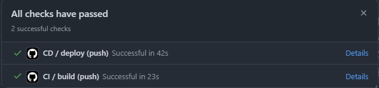

# DEVOPS | DEVSECOPS | CI/CD CONCEPTS :truck:

This repository provides an explanation of Devops, DevSecOps, CI/CD concepts and creating pipelines using GitHub Actions, as well as a test deployment using Azure App Services.

## DevOps

"DevOps is a software development methodology that accelerates the delivery of high-quality applications and services by combining and automating the work of software development and IT operations teams." IBM

__Objective__: keep up w/ growing demand for uninterrupted performance and availability in software.

:sparkles: __Key Points__

___Integration and automation___> DevOps brings together shared practices and tools to make software development more efficient and faster with small and frequent updates.

___Cultural shift___ > DevOps is apresented that a representation of change in organizational culture, incorporating the participation of all stakeholders in the software lifecycle. 

___Evolution of Delivery Process___ > The current stage of evolution in the software delivery process: from large and infrequent releases to smaller and interative updates released.  

___Origin___ > It emerged as an extension of agile methodologies, which began to be adopted in the 2000s. DevOps added new process and tools to accelerate development and improve softaware quality that extend continuous iteration and CI/CD automation to entire software delivery lifecycle.


### About DevOps Lifecycle - Overview

<div style="display: flex; align-items: center; ">
  
  <div>
    <strong>PLAN</strong> - Teams identify what the business needs and collect users feedback. They create a project roadmap to ensure the product delivers maximum value. <br>
    <strong>CODE</strong> - Devs write the code using tools like Git to keep the process smooth and avoid mistakes. <br>
    <strong>BUILD</strong> - After coding, devs add their work to a shared code repository. <br>
    <strong>TEST</strong> - The build is tested in a test environment to check the quality aspects like security, integration, and performance. <br>
    <strong>RELEASE</strong> - Once the tests are passed, the build is ready for deployment. The team schedules the release or deploys it to production. <br>
    <strong>DEPLOY</strong> - The PRD environment is prepared using IaC and the build is deployed using various tools. <br>
    <strong>OPERATE</strong> - The release is now live for customers. The operations team manages server configuration and provisioning. <br>
    <strong>MONITOR</strong> - The entire system is monitored based on customer behavior and application performance to identify any issues that could impact the team's productivity.
  </div>
</div>

## DevSecOps

It is a version of DevOps that includes security throughout the entire DevOps lifecycle, from planning to feedback and back to planning again.

DevSecOps has emerged as a solution to two major challenges that have made it difficult to fully integrate security into DevOps:

1. Incorporating security expertise into cross-functional teams (a cultural issue).

2. Automating security within the DevOps process (a technical issue).

With the security was often seen as a roadblock and an extra cost in many DevOps practices. DevSecOps was developed to address these issues by making security an integral part of the process, alongside development and operations, ensuring that security is a key focus from the start.

The idea is that DevSecOps solves these challenges of integrating security into DevOps by promoting a culture where everyone is responsible for security, automating continuous testing and monitoring to detect vulnerabilities from the outset, and integrating security tools directly into development pipelines.

## CI/CD

CI And CD is the practice of automating the integration of code changes from multiple developers into a single codebase. It is a software development practice where the developers commit their work frequently to the central code repository. Then there are automated tools that build the newly committed code and do a code review, etc as required upon integration.

The key goals of Continuous Integration are to find and address bugs quicker, make the process of integrating code across a team of developers easier, improve software quality, and reduce the time it takes to release new feature updates.

### Continuous Integration

<div style="display: flex; align-items: center;">
  
  <p>
    When devs work in isolation for extended periods and only merge their changes when they're done, it can lead to many conflicts, accumulated bugs, and slower updates. With CI, the idea is that devs frequently commit to a shared repository. The CI pipeline automates the build, testing, and code review processes, making it easier to quickly detect issues and deliver updates more efficiently.
  </p>
</div>

### Continuous Delivery

<div style="display: flex; align-items: center;">
  
  <p>
    It helps devs test their code in an environment similar to production, reducing surprises and bugs before release. It automates the release process, ensuring low risk, high quality releases and faster updates to customers. CD follows CI and includes running tests like integration and regression in a staging area. It keeps the software always ready for deployment, with some tools managing the process.
  </p>
</div>

### Configuring CI/CD pipelines

The YAML files play a crucial role in configuring CI/CD pipelines by providing a clear and structured way to define the stages and processes needed for automating software development and delivery.

1. YAML uses a hierarchical structure based on indentation to represent data.
2. Keys and values are defined with two or more spaces of indentation.
3. It does not use brackets or braces, its simpler to read.
4. Keys and Values
   - __Keys__ represent categories or configurations, followed by a colon ( : )
   - __Values__ can be strings, numbers, lists, or objects.
    ``` yaml
    name: CI Pipeline
    trigger: push
    ```
5. Lists
   - Used to represent multiple items under a key, preceded by a hyphen ( - )
   ``` yaml
   stages:
     - build
     - test
     - deploy
   ```
6. Nested objects
   - To represent more complex structures 
   ``` yaml
   jobs:
     build:
       script:
        - make build
        - make test
   ```
7. Job and Step Definitions
   - __Jobs__ are tasks that make up the pipeline (build, test, deploy).
   - __Steps__ are the commands executed within each job.
   ``` yaml
   jobs:
     build:
       steps:
        - name: Checkout code
            run: git checkout .
        - name: Build project
            run: make build
   ```
8. Variables
   - Allow defining reusable values throughout the pipeline
   ``` yaml
    variables:
      IMAGE_NAME: myapp
   ```
9. Triggers 
   - Define when and how the pipeline should run, such as on a push to a specific branch or a pull request
   ``` yaml
   trigger:
     branches:
       include:
         - main
   ```
10. File Example using Github Actions
    - .github/workflows/ci.yml
    ``` yaml
    name: CI Pipeline
    on: [push]
    jobs:
    build:
        runs-on: ubuntu-latest
        steps:
        - name: Checkout code
            uses: actions/checkout@v2
        - name: Build and test
            run: |
            make build
            make test
    ```

## Hands on :hand:
Deploy to App Service using Azure + Github Actions



[singleton-scoped-transient-dotnet/.github/workflows](https://github.com/kmlyteixeira/singleton-scoped-transient-dotnet/tree/master/.github/workflows)


## Learn More :books:

- [IBM - DevOps Topics](https://www.ibm.com/br-pt/topics/devops)
- [Simform - DevOps Lifecycle](https://www.simform.com/blog/devops-lifecycle/)
- [GeeksforGeeks - What is CI/CD?](https://www.geeksforgeeks.org/what-is-ci-cd/)
- [DevOps - Código Fonte TV](https://www.youtube.com/watch?v=iwf6kcvxeD4&pp=ygUTZGV2b3BzIGNvZGlnbyBmb250ZQ%3D%3D)
- [DevSecOps (Segurança no Ciclo de Desenvolvimento de Software) - Código Fonte TV](https://www.youtube.com/watch?v=CCp30BD9uRo)
- [Azure Pipelines documentation](https://learn.microsoft.com/en-us/azure/devops/pipelines/?view=azure-devops)
- [Deploy to App Service using Azure Pipelines](https://learn.microsoft.com/en-us/azure/app-service/deploy-azure-pipelines?tabs=yaml)
- [Azure Resource Manager QuickStart Templates](https://github.com/Azure/azure-quickstart-templates)